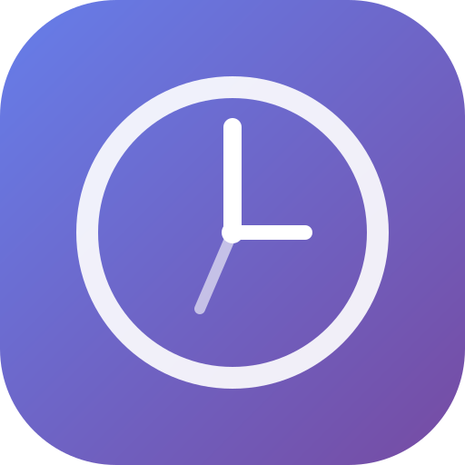
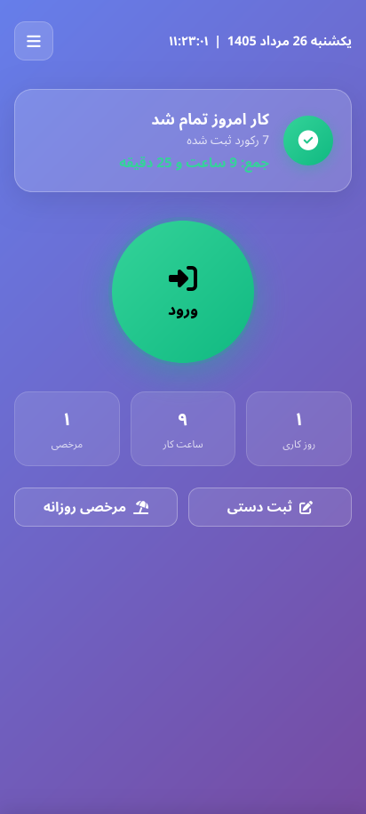
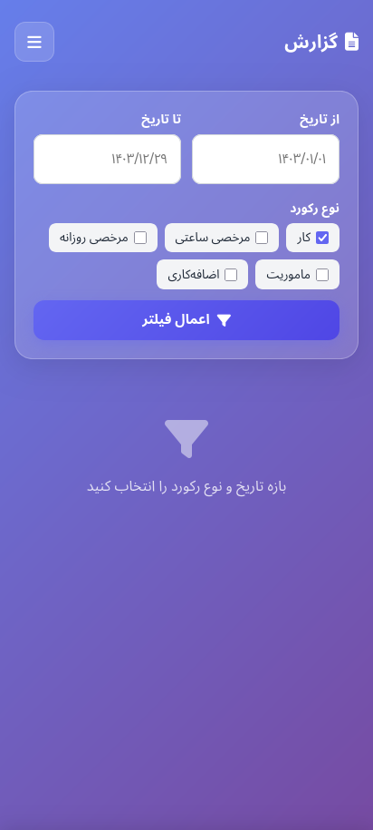

# 📋 سیستم حضور و غیاب شخصی

<p align="center">
  
</p>

<p align="center">
  <b>یک PWA کاملاً آفلاین برای ثبت و مدیریت ساعات کاری، مرخصی و ماموریت</b>
</p>

<p align="center">
  
  
  
  
</p>

---

## ✨ ویژگی‌ها

- ⚡ **ثبت سریع ورود/خروج** — فقط با یک دکمه
- 📅 **تقویم شمسی کامل** — با Date Picker استاندارد
- 🔄 **چندین رکورد در یک روز** — پشتیبانی از ورود/خروج‌های متعدد
- 📊 **گزارش‌گیری پیشرفته** — فیلتر بازه تاریخی + خروجی Excel
- 📤 **اشتراک‌گذاری** — ارسال گزارش از طریق واتساپ، تلگرام، ایمیل
- 🖨️ **پرینت حرفه‌ای** — نسخه پرینت‌فرندلی از گزارش
- 💾 **ذخیره‌سازی محلی** — تمام داده‌ها در localStorage مرورگر
- 📦 **پشتیبان‌گیری** — خروجی و بازگردانی JSON
- 📱 **PWA کامل** — قابل نصب روی موبایل و دسکتاپ
- 🌐 **کاملاً آفلاین** — بدون نیاز به اینترنت پس از نصب

---

## 🚀 نصب و اجرا

### روش ۱: اجرای مستقیم (سریع)

```bash
# ۱. کلون کردن پروژه
git clone https://github.com/saeedsajadi/attendance-pwa.git

# ۲. ورود به پوشه
cd attendance-pwa

# ۳. اجرا با یک سرور محلی ساده
python3 -m http.server 8000
# یا
npx serve .
```

سپس مرورگر را باز کنید و به آدرس زیر بروید:
```
http://localhost:8000
```

### روش ۲: باز کردن مستقیم فایل HTML

فایل `index.html` را مستقیماً در مرورگر (Chrome/Edge/Safari) باز کنید.

> ⚠️ **نکته:** برای فعال شدن کامل Service Worker و قابلیت PWA، استفاده از `localhost` یا `HTTPS` توصیه می‌شود.

---

## 📱 نصب روی موبایل (PWA)

### اندروید (Chrome)
۱. سایت را در Chrome باز کنید
۲. منوی ⋮ → **Add to Home screen** را بزنید

### iOS (Safari)
۱. سایت را در Safari باز کنید
۲. دکمه Share (⬆️) را بزنید
۳. **Add to Home Screen** را انتخاب کنید

### دسکتاپ (Chrome/Edge)
۱. سایت را باز کنید
۲. روی آیکون نصب (📥) در نوار آدرس کلیک کنید

---

## 🗂️ ساختار پروژه

```
attendance-pwa/
├── index.html              # صفحه اصلی - ورود/خروج سریع
├── records.html            # صفحه لیست سوابق و ویرایش
├── report.html             # صفحه گزارش‌گیری و خروجی اکسل
├── settings.html           # صفحه تنظیمات و مدیریت داده
├── css/
│   ├── main.css            # استایل‌های پایه، فونت، متغیرها
│   └── components.css      # کامپوننت‌های مشترک
├── js/
│   ├── app.js              # منطق PWA و Service Worker
│   ├── db.js               # مدیریت localStorage
│   ├── date-utils.js       # توابع کمکی تقویم شمسی
│   ├── ui.js               # توابع مشترک UI
│   └── pages/
│       ├── home.js         # منطق صفحه اصلی
│       ├── records.js      # منطق صفحه سوابق
│       ├── report.js       # منطق صفحه گزارش
│       └── settings.js     # منطق صفحه تنظیمات
├── sw.js                   # Service Worker (آفلاین)
├── manifest.json           # مانیفست PWA
├── assets/
│   └── logo.svg            # لوگوی SVG
└── README.md               # همین فایل
```

---

## 🛠️ تکنولوژی‌ها

| تکنولوژی | کاربرد |
|----------|--------|
| HTML5 | ساختار صفحات |
| CSS3 + Glassmorphism | طراحی مدرن و شیشه‌ای |
| Vanilla JavaScript (ES6+) | منطق برنامه بدون فریم‌ورک |
| [Moment.js](https://momentjs.com/) + [moment-jalaali](https://github.com/jalaali/moment-jalaali) | تقویم شمسی و تاریخ |
| [Persian Datepicker](https://babakhani.github.io/PersianWebToolkit/doc/datepicker/) | Date Picker شمسی حرفه‌ای |
| [SheetJS (xlsx)](https://sheetjs.com/) | خروجی Excel |
| Service Worker | کش‌گذاری و آفلاین |
| localStorage | ذخیره‌سازی داده‌ها |

---

## 📸 اسکرین‌شات‌ها

<p align="center">
  
  
  
</p>

---

## 🧩 انواع رکورد

| نوع | آیکون | توضیح |
|-----|-------|-------|
| کار عادی | 💼 | ورود/خروج روزانه |
| مرخصی ساعتی | ⏰ | مرخصی با ساعت مشخص |
| مرخصی روزانه | 🏖️ | مرخصی بدون ساعت (تمام روز) |
| ماموریت | 🚗 | ماموریت کاری |
| اضافه‌کاری | ⏳ | کار خارج از ساعت اداری |

---

## 💾 فرمت داده‌ها

داده‌ها به صورت JSON در `localStorage` با کلید `attendance_v2` ذخیره می‌شوند:

```json
{
  "id": "string-unique",
  "date": "1403/05/17",
  "type": "work | hourly_leave | daily_leave | mission | overtime",
  "checkIn": "08:30:00",
  "checkOut": "17:15:00",
  "description": "توضیحات اختیاری"
}
```

---

## 🔒 حریم خصوصی

> **همهٔ داده‌ها فقط در مرورگر شما و به صورت محلی ذخیره می‌شوند.**
> هیچ اطلاعاتی به سرور ارسال نمی‌شود. این برنامه کاملاً Client-Side است.

---

## 🌐 پشتیبانی مرورگر

| مرورگر | پشتیبانی |
|--------|----------|
| Chrome | ✅ کامل |
| Edge | ✅ کامل |
| Safari | ✅ کامل |
| Firefox | ✅ کامل |
| Opera | ✅ کامل |

---

## 🤝 مشارکت

مشارکت شما خوش‌آمد است! لطفاً:

1. پروژه را Fork کنید
2. Branch خود را بسازید (`git checkout -b feature/amazing-feature`)
3. تغییرات را Commit کنید (`git commit -m 'Add amazing feature'`)
4. Push کنید (`git push origin feature/amazing-feature`)
5. Pull Request بسازید

---

## 📄 مجوز

این پروژه تحت مجوز **MIT** منتشر شده است. برای اطلاعات بیشتر فایل [LICENSE](LICENSE) را ببینید.

---

## 🙏 سپاسگزاری

- [Vazirmatn Font](https://github.com/rastikerdar/vazirmatn) — فونت فارسی زیبا
- [Font Awesome](https://fontawesome.com/) — آیکون‌ها
- [Moment.js](https://momentjs.com/) و [moment-jalaali](https://github.com/jalaali/moment-jalaali) — تقویم شمسی
- [Persian Datepicker](https://babakhani.github.io/PersianWebToolkit/) — Date Picker شمسی
- [SheetJS](https://sheetjs.com/) — تولید فایل Excel

---

<p align="center">
  ساخته شده با ❤️ برای کاربران فارسی‌زبان
</p>